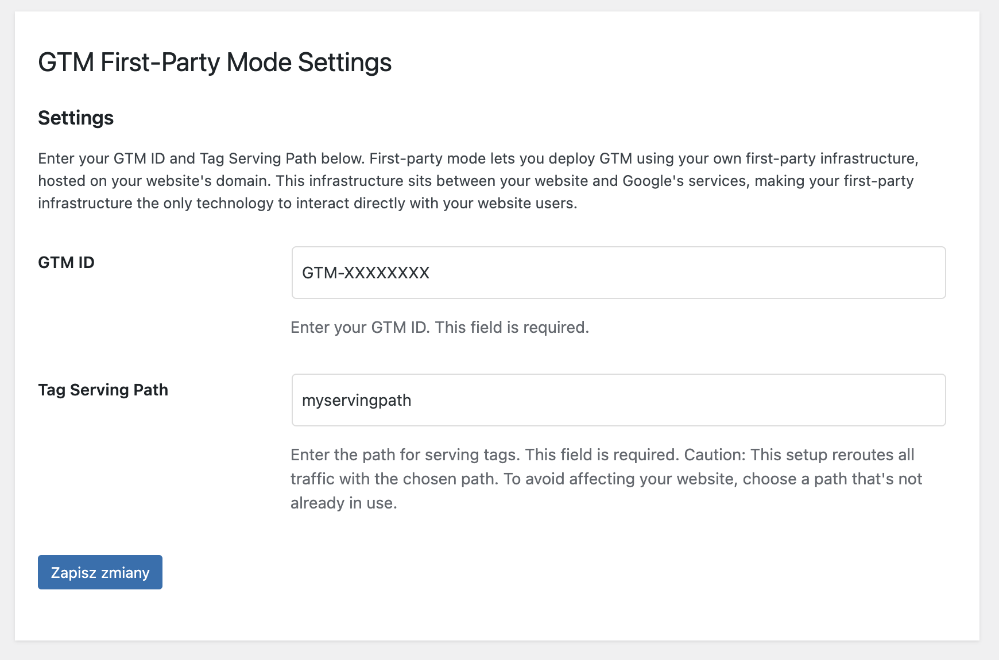
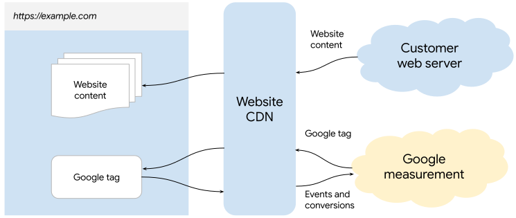

# GTM First-Party Mode Wordpress Plugin

Routes requests through WordPress backend to fps.goog and inserts GTM script in `<head>` for first-party data tracking.

## Description

GTM First-Party Mode WordPress Plugin routes requests through the WordPress backend to fps.goog and inserts GTM script in `<head>` for first-party data tracking. This plugin allows you to deploy Google Tag Manager using your own first-party infrastructure, hosted on your website's domain. Unlike other setups that require a CDN or load balancer, this free plugin leverages your existing WordPress site to route requests, making it simple and cost-effective to enhance data privacy and security.

## Architecture Diagram

The following diagram represents the information flow in first-party mode:

*Instead of CDN you will be using the GTM FPM Plugin.*

For more information about First-Party Mode, visit the [Google Tag Manager First-Party Setup Guide](https://developers.google.com/tag-platform/tag-manager/first-party/setup-guide).

## Installation of the plugin

1. **Download the Plugin:**
   - If you are downloading from GitHub, click on the green "Code" button and select "Download ZIP".
   - Extract the ZIP file and locate the `gtm-fpm` folder inside the extracted contents.

2. **Upload the Plugin:**
   - Upload the plugin using Wordpress Admin Panel.

3. **Activate the Plugin:**
   - Go to the 'Plugins' screen in WordPress and activate the `GTM First-Party Mode` plugin.

4. **Configure the Plugin:**
   - Use the `Settings->GTM First-Party Mode` screen to configure the plugin by entering your GTM ID and Tag Serving Path.

## Usage

- Enter your GTM ID and Tag Serving Path in the plugin settings page.
- Make sure to use a different GTM container if you're using the GTM4WP plugin or disable script injection in other GTM plugins.

## Changelog

### 1.20
* Initial release.

## Contributing

If you have any suggestions, feel free to open an issue or submit a pull request.

## License

This plugin is licensed under the GPLv2 or later. See the [LICENSE](license.txt) file for more details.
